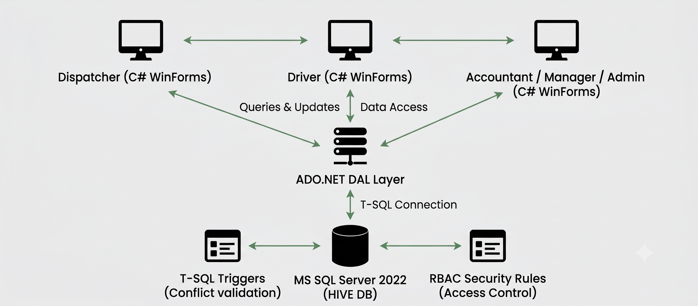

#  HIVE Logistics Management System
**Academic Business Analysis & System Design Case Study**

> **Academic Institution:** University of Finance - Marketing (UFM), Ho Chi Minh City  
> **Faculty:** Faculty of Data Science | **Department:** Management Information Systems (MIS)  
> **Course:** Professional Practice Report (Thực hành nghề nghiệp)  
> **Author:** Trịnh Hoàng Ngân  
> **Advisor:** M.Sc. Lâm Hoàng Trúc Mai  
> **Target Enterprise:** HIVE Transportation Services Trading Co., Ltd.  
> **Tools & Methodology:** Business Analysis (BABOK, BPMN 2.0, DFD, UML), SQL Server 2022 (T-SQL, Triggers, RBAC), C# .NET Windows Forms, PowerDesigner, Draw.io.

---

##  1. Project Overview

### 1.1 Business Context
HIVE Transportation Services Trading Co., Ltd. is an internal logistics and transport coordination firm providing freight delivery across urban and inter-provincial routes. As order volume grew, the company experienced operational challenges due to fragmented, manual record-keeping—relying on paper notes, disconnected Excel spreadsheets, phone calls, and Zalo messaging groups.

### 1.2  Key Operational Pain Points
To address several key drivers of operational inefficiency, the business analysis identified five core pain points:

| Operational Domain | AS-IS Manual Bottleneck | Impact on Business Operations |
| :--- | :--- | :--- |
| **1. Data Management** | **Fragmented Records** Operational records scattered across paper slips, Excel files, and Zalo chats. | High risk of data loss, lack of audit trail, and impossible to track order history. |
| **2. Resource Dispatching** | **Manual Phone Verification** Dispatchers check truck/driver availability via manual phone calls. | Frequent scheduling conflicts, truck double-booking, and dispatch delays. |
| **3. Delivery Execution** | **Transit Information Lag** Drivers report trip milestones manually via phone calls or texts. | Delayed milestone visibility for dispatchers, leading to client complaints. |
| **4. Accounting & Billing** | **Manual Reconciliation** Accountants manually cross-reference delivery slips with bank statements. | High human error rate, delayed invoicing, and slow payment reconciliation. |
| **5. Executive Oversight** | **Absence of Central Reporting** No central dashboard or automated reporting system for management. | Leadership lacks visibility into daily revenue, fleet utilization, and driver KPIs. |

### 1.3 Proposed Solution
This academic case study delivers a comprehensive, end-to-end Business Analysis & System Design Blueprint designed to digitize HIVE's transport coordination workflows:
*   **Requirements Engineering & Process Modeling:** Re-engineering manual operations into a streamlined TO-BE digital process using BABOK-aligned requirements elicitation, process modeling (BPMN 2.0, 2-level DFD, BFD), and UML Use Case specifications (56 Use Cases).
*   **Database Engineering & Business Rule Enforcement:** Implementing a structured relational database (`QuanLyDieuPhoiVanChuyen_HIVE`) with automated T-SQL triggers to enforce business constraints and Role-Based Access Control (RBAC).
*   **Application Validation:** Developing a functional C# WinForms desktop application connected to SQL Server to validate the feasibility and logical flow of end-to-end operational workflows and Use Cases across 5 user roles.

---

##  2. My Contribution

| Core Domain | Key Contributions & Delivered Artifacts |
| :--- | :--- |
| **1. Requirements Engineering & Process Modeling** | • Elicited 25 Functional & 18 Non-Functional Requirements across 5 business modules. • Modeled AS-IS & TO-BE workflows using BPMN 2.0, BFD, 2-level DFD (Context Level & Level 0), and UML (56 Use Cases). • Defined formal business rules and integrity constraints for schedule conflict prevention. |
| **2. Database Engineering & Business Rule Enforcement** | • Designed a structured relational schema with 20 physical tables in SQL Server. • Translated core business rules into automated T-SQL Triggers (`TRG_LenhDieuPhoi_KhongTrungTaiXe`, `TRG_LenhDieuPhoi_KhongTrungPhuongTien`, `TRG_ChiTietHDVC_CapNhatTongTienHoaDon`). • Configured granular RBAC across 5 system roles (`VT001`–`VT005`) and 67 permission rules (`Q001`–`Q067`). |
| **3. Application Development & Workflow Validation** | • Developed a functional C# WinForms desktop application connected to SQL Server via ADO.NET. • Built 5 role-based UI interfaces specifically to validate the feasibility and logical flow of analyzed business workflows and Use Cases. |

---

##  3. Business Analysis & System Modeling

### 3.1 TO-BE Business Architecture & Workflow
The TO-BE Process digitizes the core delivery lifecycle into a streamlined workflow connecting 5 internal operational roles:

| Step | Workflow Stage | Responsible Role | Key Operations & System Outputs |
| :--- | :--- | :--- | :--- |
| 1 | **Order Intake & Validation** | Dispatcher (Điều phối) | Inputs order details; system validates addresses/cargo and generates a unique tracking ID (`DVCxxx`). |
| 2 | **Resource Dispatching** | Dispatcher (Điều phối) | Filters available drivers & vehicles; system checks for schedule conflicts via T-SQL triggers before issuing dispatch orders (`LDPxxx`). |
| 3 | **Delivery Execution** | Driver (Tài xế) | Receives trip assignment via "My Tasks" UI, accepts/rejects, logs real-time milestone timestamps, and records transit incidents. |
| 4 | **Financial Settlement** | Accountant (Kế toán) | Records payment receipts (`PTTxxx`), validates bank transaction codes, and generates VAT invoices (`HDxxx`). |
| 5 | **Executive Oversight** | Manager (Quản lý) | Monitors real-time management dashboard for revenue trends, order completion rates, and fleet utilization. |

> 📸 **Image Placeholder 02:** *Chèn hình ảnh Sơ đồ Quy trình TO-BE (BPMN 2.0) chi tiết cho luồng điều phối giao nhận.*

---

### 3.2 System Requirements Specification (BRD)

** Functional Requirements (25 Core FRs)**
The 25 functional requirements are structured into 5 core operational modules:
1.  **Order Intake & Lifecycle Tracking (FR-01 to FR-05):** Centralized order creation, unique tracking code generation (`DVCxxx`), multi-criteria filtering, and lifecycle state transitions (New ➔ Dispatching ➔ Assigned ➔ In-Transit ➔ Completed ➔ Cancelled).
2.  **Resource Dispatching & Schedule Validation (FR-06 to FR-10):** Real-time monitoring of driver licenses and vehicle tonnage capacities, system-assisted resource filtering, and dispatch order generation (`LDPxxx`).
3.  **Driver Workspace & Milestone Reporting (FR-11 to FR-15):** Dedicated "My Tasks" interface for drivers, trip acceptance/rejection with mandatory reason logging, 1-click status updates, and transit incident reporting.
4.  **Billing, Invoicing & Financial Settlement (FR-16 to FR-20):** Payment receipt logging (`PTTxxx`), bank transaction code tracking, automated VAT invoice calculation (`HDxxx`), and unpaid account tracking.
5.  **Role-Based Security & Executive Reporting (FR-21 to FR-25):** Granular RBAC permission mapping, user account lifecycle management, printable document exports (PDF/CSV), and real-time executive dashboard analytics.

** Key Non-Functional Requirements (18 NFRs)**
*   **Performance:** Query response time $\le$ 2–5 seconds for standard operations.
*   **Concurrency:** Multi-user support with isolated transaction sessions.
*   **Security & RBAC:** Passphrase-encrypted credentials and role-based menu restrictions.
*   **Data Integrity:** Strict validation on Tax IDs, phone numbers, addresses, and delivery dates.
*   **Auditability:** Append-only status history logs capturing user actions, timestamps, and state changes.

---

### 3.3 Modeling Diagrams
To transform raw requirements into a structured system architecture, standard modeling techniques were applied:

**1. Business Function Diagram (BFD)**
> **BA Modeling Objective:** Applied BFD for functional decomposition, breaking down HIVE's overall logistics operations into **5 Primary Operational Pillars**: System Security & Admin, Logistics Master Data, Order Management & Dispatching, Financial Settlement, and Reporting & Analytics.

> 📸 **Image Placeholder 03:** *Chèn hình ảnh Sơ đồ Phân rã Chức năng (Business Function Diagram - BFD).*

**2. Data Flow Diagrams (DFD)**
> **BA Modeling Objective:** Applied **2-level DFDs** to establish clear system boundaries and map data flows between external entities, core business processes, and central data stores across departments.
*   **Context Level DFD:** Defines system boundaries between the central platform and external actors (Customer, Management).
*   **Level 0 DFD:** Decomposes into 5 core processes interacting with 4 data stores (`D1: Master Data`, `D2: Orders & Dispatch`, `D3: Payments & Invoices`, `D4: Security & Accounts`).

> 📸 **Image Placeholder 08:** *Chèn hình ảnh Sơ đồ Luồng Dữ liệu (DFD) Mức Ngữ cảnh (Context Level Diagram).*

> 📸 **Image Placeholder 04:** *Chèn hình ảnh Sơ đồ Luồng Dữ liệu (DFD) Mức 0 (Level 0 Diagram).*

**3. UML Use Case Architecture**
> **BA Modeling Objective:** Applied UML Use Case modeling to specify **detailed functional interactions** across 5 user roles (**Dispatcher**, **Driver**, **Accountant**, **Manager**, **Admin**) and 1 automated system actor (**System Handler**), encompassing **56 Use Cases** (`UC001` to `UC056`).
> 
> To demonstrate analytical depth, in addition to the master system-level Use Case diagram, each core management module is further decomposed into detailed sub-use case diagrams (Abstract / Sub-diagrams) to clarify granular `<<extend>>` and `<<include>>` operational paths:
> * **Customer Management (`UC010`–`UC014`):** Sub-diagram detailing client profile creation, multi-criteria search, and information updates (`uc1.png`).
> * **Fleet & Driver Resource Management (`UC015`–`UC024`):** Sub-diagram mapping driver license classes, vehicle tonnage tracking, and operational status toggling (`uc2.png`).
> * **Dispatch Operations (`UC025`–`UC031`):** Sub-diagram specifying driver/vehicle matching, dispatch slip issuance, and reassignment (`uc3.png`).
> * **Transport Order Management (`UC032`–`UC039`):** Sub-diagram detailing order creation, immutable tracking code generation (`DVCxxx`), and status audit trails (`uc4.png`).
> * **Payment & Invoicing (`UC040`–`UC045`):** Sub-diagram mapping transaction logging, bank code verification, and VAT invoice issuance (`uc5.png`).
> * **User Account Security (`UC046`–`UC051`):** Sub-diagram specifying user provisioning, password resets, and account status management (`uc6.png`).
> * **Reporting & Analytics (`UC052`–`UC056`):** Sub-diagram mapping executive KPI dashboards, revenue filtering, and report exports (`uc7.png`).

> 📸 **Image Placeholder 05:** *Chèn hình ảnh Sơ đồ Tổng quan Use Case UML (Master UML Use Case Diagram) cùng bộ 7 sơ đồ phân rã Use Case con (Sub-diagrams) cho từng phân hệ quản lý.*

---

### 3.4 Business Rules & Schedule Integrity Constraints
>  **BA System Thinking & Technical Enforcement:** Defining **clear, structured business rules** and operational constraints during analysis is critical for technical execution. By establishing **well-defined logical rules** during the BA phase, developers received **clear specifications** to enforce data integrity directly at the database layer via automated T-SQL triggers.

**Core Business Rules & System Constraints:**
1.  **Driver Schedule Overlap Constraint:**
    *   **Business Rule:** A driver cannot be assigned to two active transport orders with overlapping time slots.
    *   **Technical Enforcement:** Implemented via `TRG_LenhDieuPhoi_KhongTrungTaiXe`, which checks active dispatch states (`Chờ xác nhận`, `Đã tiếp nhận`, `Đang thực hiện`) and automatically rolls back conflicting assignments.
2.  **Vehicle Double-Booking Constraint:**
    *   **Business Rule:** A vehicle cannot be assigned to multiple concurrent dispatch orders at the same scheduled time.
    *   **Technical Enforcement:** Implemented via `TRG_LenhDieuPhoi_KhongTrungPhuongTien`, enforcing fleet allocation integrity during order dispatching.
3.  **Automated Invoicing & VAT Recalculation Rule:**
    *   **Business Rule:** Invoices must automatically recalculate pre-tax line item totals and compute VAT amounts whenever charges or line items change.
    *   **Technical Enforcement:** Implemented via `TRG_ChiTietHDVC_CapNhatTongTienHoaDon` to minimize manual calculation errors and reduce reconciliation effort.

---

## 4. Database & Technical Support (`QuanLyDieuPhoiVanChuyen_HIVE`)

To support the business processes and data flows identified during analysis, a relational database schema was implemented in Microsoft SQL Server 2022.

### 4.1 Relational Schema Overview (20 Tables)
The database consists of 20 physical tables organized across 5 functional domains:

| Domain / Module | Operational Focus | Relational Tables | Table Count |
| :--- | :--- | :--- | :--- |
| **1. Personnel & Security** | User accounts, roles, permissions & organizational hierarchy | `ChucVu`, `NhanVien`, `TaiKhoan`, `VaiTroHeThong`, `Quyen`, `PhanQuyen` | 6 |
| **2. Customer Management** | Client profiles (corporate/individual) & categories | `LoaiKhachHang`, `KhachHang` | 2 |
| **3. Fleet & Cargo Assets** | Transport vehicles, tonnage capacities & cargo types | `LoaiPhuongTien`, `PhuongTien`, `LoaiHangHoa` | 3 |
| **4. Transport Operations** | Orders, order items, dispatch slips, status history & incident logs | `DonVanChuyen`, `ChiTietDVC`, `LenhDieuPhoi`, `LichSuTrangThaiDon`, `PhieuPhatSinhVC` | 5 |
| **5. Billing & Invoicing** | Payment receipts, VAT invoices & fee categories | `PhieuThanhToanVC`, `HoaDonVanChuyen`, `LoaiPhiVanChuyen`, `ChiTietHDVC` | 4 |

> 📸 **Image Placeholder 06:** *Chèn hình ảnh Sơ đồ ERD Vật lý (Physical ERD Diagram) 20 bảng trong SQL Server.*

---

### 4.2 Automated T-SQL Business Rule Triggers
Key business rules from the analysis phase were embedded directly into SQL Server via T-SQL triggers to enforce data integrity at the database layer:
*   **Driver Double-Booking Prevention (`TRG_LenhDieuPhoi_KhongTrungTaiXe`):** Checks active dispatch orders (`Chờ xác nhận`, `Đã tiếp nhận`, `Đang thực hiện`) and rolls back any attempt to assign a driver to an overlapping time slot.
*   **Vehicle Double-Booking Prevention (`TRG_LenhDieuPhoi_KhongTrungPhuongTien`):** Prevents assigning the same vehicle to multiple concurrent dispatch slips.
*   **Automated Invoicing & VAT Recalculation (`TRG_ChiTietHDVC_CapNhatTongTienHoaDon`):** Automatically recalculates pre-tax totals and computes final VAT amounts upon line item updates.

---

### 4.3 Role-Based Access Control (RBAC)
Database access is secured using 67 System Permissions mapped across 5 User Roles:

| Role ID | System Role Name | Target User Group | Mapped Permissions (`Q001`–`Q067`) | Operational Scope & Authority |
| :--- | :--- | :--- | :--- | :--- |
| `VT001` | **Dispatcher** | Nhân viên Điều phối | `Q021–Q027`, `Q030`, `Q033`, `Q036–Q051` | Order intake, fleet lookup, driver dispatching |
| `VT002` | **Driver** | Tài xế | `Q036`, `Q040`, `Q044`, `Q047–Q050` | View assigned trips, update milestone status, log incidents |
| `VT003` | **Accountant** | Kế toán | `Q024`, `Q036`, `Q040`, `Q052–Q065`, `Q067` | Record payments, issue VAT invoices, export financial reports |
| `VT004` | **Manager** | Ban Quản lý | Read-only operational tables + `Q066–Q067` | Executive dashboard, revenue analytics, driver performance |
| `VT005` | **System Admin** | Quản trị hệ thống | Full Access (`Q001–Q067`) | User provisioning, RBAC configuration, audit logging |

> 📸 **Image Placeholder 10:** *Chèn hình ảnh Ma trận Phân quyền RBAC (Role-Based Access Control Matrix).*

---

## 5. C# WinForms Application & Workflow Validation

### 5.1 Purpose & Role in Business Analysis
While the primary focus of this case study is Business Analysis & System Design, a functional C# WinForms desktop application was developed specifically to validate and test the feasibility and logical flow of the analyzed business workflows (BPMN), system rules, and 56 Use Cases in a simulated operational environment.

### 5.2 Role-Based User Interfaces & Validation Scope
The application connects to SQL Server via ADO.NET and implements 5 role-based user interfaces corresponding directly to the operational roles defined during requirements analysis:
*   **Dispatcher Board:** Validates order intake (`DVCxxx`), driver/vehicle availability matching, and dispatch slip creation (`LDPxxx`) with trigger conflict checks.
*   **Driver Workspace ("Nhiệm vụ của tôi"):** Validates task acceptance/rejection, real-time milestone timestamp updates, and transit incident logging.
*   **Accounting Desk:** Validates payment receipt logging (`PTTxxx`), bank transaction code tracking, and automated VAT invoice generation (`HDxxx`).
*   **Executive Dashboard:** Validates real-time summary cards, revenue trend charts, and fleet utilization reporting for management decision-making.
*   **Admin Security Center:** Validates user account provisioning and granular RBAC permission matrix enforcement (`Q001`–`Q067`).

> 📸 **Image Placeholder 07:** *Chèn hình ảnh Giao diện Ứng dụng C# WinForms (Form Điều phối & Xử lý sự cố).*

---

## 6. Repository Layout & Artifacts

| Directory / File Path | Asset Type | Description & Repository Contents |
| :--- | :--- | :--- |
| `/README.md` | **Master Documentation** | Project overview, BA contributions, workflow specifications & database architecture |
| `/Project_Report.pdf` | **Academic Report** | Full academic business analysis and system design case study report |
| `/01-Business-Analysis/` | **BA Requirements** | BPMN process models, 2-level DFDs (Context Level & Level 0), BFD, UML Use Cases |
| `/02-Database-Design/` | **SQL Database** | Physical ERD diagram + Master T-SQL script (`QuanLyDieuPhoiVanChuyen_HIVE.sql`) |
| `/03-Software-Application/` | **C# Application** | Visual Studio Solution (`.sln`), C# WinForms UI forms, and ADO.NET data layer |

---

##  7. Future Roadmap & Potential Enhancements
To build upon the current system design and software implementation, several practical, incremental enhancements are identified for future development:
*   **Mobile Interface for Drivers:** Extending the Driver Workspace ("Nhiệm vụ của tôi") from the desktop client to a mobile-responsive web view or cross-platform mobile application (e.g., Flutter) so drivers can update trip milestones on the go.
*   **Automated Customer Notifications:** Integrating an Email or Zalo OA / SMS gateway to automatically send status updates and digital payment receipts to clients upon order dispatch and completion.
*   **Interactive Dashboard Analytics:** Enhancing the Executive Console in WinForms with interactive chart controls (e.g., LiveCharts) for visual trend analysis on monthly revenue, order completion rates, and fleet utilization.
*   **Multi-Branch / Multi-Depot Expansion:** Extending the database schema to support multi-depot operations, allowing HIVE to manage regional branch offices and inter-depot transport assignments.
*   **Advanced Report Exporting:** Adding formatted Excel (`.xlsx`) export templates via libraries like `ClosedXML` to streamline monthly financial reconciliation for the accounting team.

---

##  8. Academic Attribution & Credits
This project was developed as an academic case study for the Professional Practice Report (Thực hành nghề nghiệp) course in Management Information Systems (MIS) at the University of Finance - Marketing (UFM) under the academic guidance of M.Sc. Lâm Hoàng Trúc Mai.
